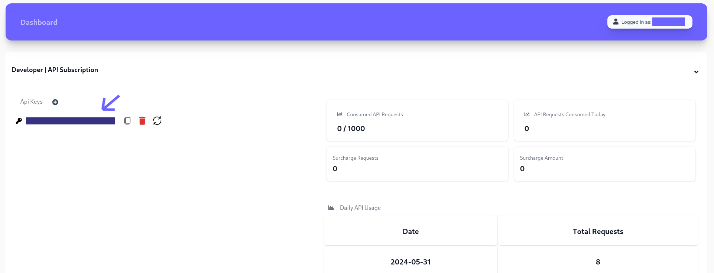

# weather-cli

A CLI designed to retrieve weather data at a given location. This CLI uses the node runtime and will need to be installed prior to the installation of this application.


## Quick Set Up

### Installation
This CLI can be installed using the npm package manager
```
$ npm i -g @brodeous/weather-cli
```
\*\* Make sure the `-g` option is passed if you would like the CLI to be accessed from anywhere in the terminal.

### Configuration
Next you need to edit the config and add your api keys for the application to retrieve it's data.

If you run the following command, you can see there are no api keys saved.
```console
$ getwet --list-keys

[API KEYS]

Geolocation > 
Weather API > 
```
\*\* For full functionality, you will need both keys. If you do not want the ability to use your current location, we will only need the weather_api key.

You will need to go to these two websites and create an account
- [ipgeolocation.io](https://ipgeolocation.io/)
- [weatherapi.com](https://www.weatherapi.com/)

Once the accounts are made, you need to grab the keys

##### IP Geolocation


##### Weather API


To then add these keys to the CLI, you will want to run these commands
##### IP Geolocation
```console
$ getwet --set-key geolocation=<api key>

[CONFIG] ip_geo_api set
```
##### Weather API
```console
$ getwet --set-key weatherapi=<api key>

[CONFIG] weather_api set
```

If you run the list command again, you should now see the keys you just set.
```console
$ getwet --list-keys

[API KEYS]

Geolocation > <geo key>
Weather API > <weather key>
```

## Usage
The CLI comes with a few options to retrieve the weather information for specific places.
```console
$ getwet -h
Usage: GetWet [options] args

A CLI that retrieves current weather data for a specific location.
    > No option will return data based on current public ip.

Options:
  -V, --version               output the version number
  -c, --city <city>           specific city
  -z, --zipcode <zipcode>     specific zipcode
  -l, --lat_long <lat,long>   specific latitude and longitude
  -s, --set_key <name>=<key>  set api key
  -ls, --list_keys            list api keys
  -h, --help                  display help for command


Example:
    --city
        $ getwet -c Dallas
        $ getwet -c 'San Diego'
        $ getwet -c San_Diego
    --zipcode
        $ getwet -z 77007
    --lat_long
        $ getwet -l 39.76893679731222,-86.1639944813316
    --set-key
        $ getwet -s geolocation=<api key>
        $ getwet -s weatherapi=<api key>

```
